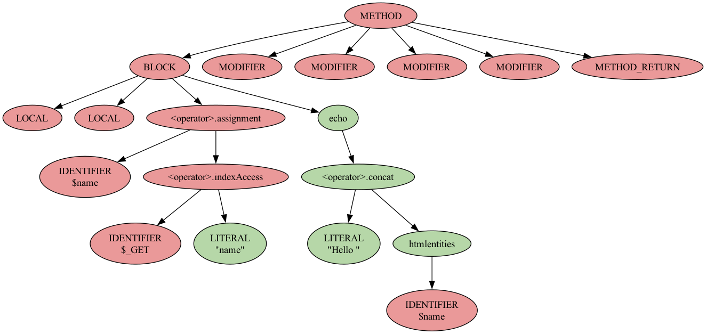
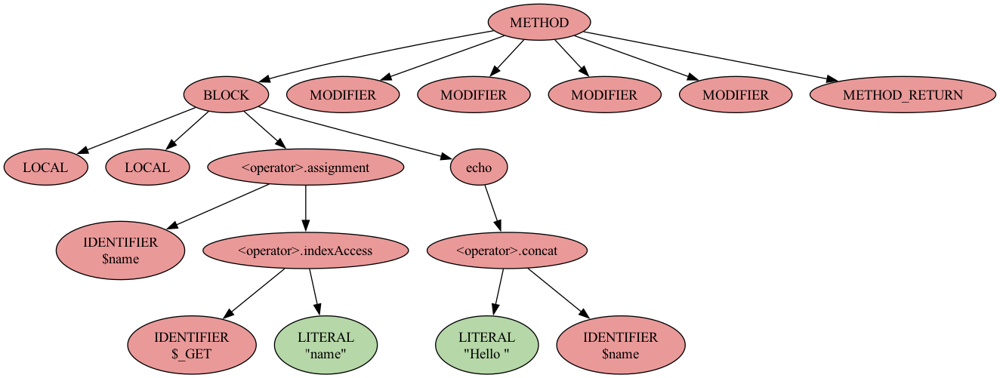

# TaintRadar

**Semantic-Aware Taint-Style Vulnerability Detection via Augmented Code Property Graphs**

TaintRadar is a static analysis framework for PHP applications. It detects taint-style vulnerabilities by analyzing Code Property Graphs (CPGs) that it first augments with:

- **Object dependency modeling**
- **Schema-aware database analysis**
- **Sanitization tracking**

These augmentations make the analysis more precise and cut down on false positives.

This project is a fork of the [standalone Joern extension](https://github.com/joernio/standalone-ext) sample repository. It adds the TaintRadar traversals, plus utility and evaluation scripts.

## Contents

- [Requirements](#requirements)
- [Installation](#installation)
- [Usage](#usage)
  - [1. (Optional) Parse the database schema](#1-optional-parse-the-database-schema)
  - [2. Parse the application into a CPG](#2-parse-the-application-into-a-cpg)
  - [3. Run TaintRadar](#3-run-taintradar)
  - [Running every application at once](#running-every-application-at-once)
- [Reproducing the paper's results](#reproducing-the-papers-results)
  - [Generate the whitelist of safe PHP functions](#generate-the-whitelist-of-safe-php-functions)
  - [Color an AST by sanitization](#color-an-ast-by-sanitization)
  - [Match vulnerable paths with public CVEs](#match-vulnerable-paths-with-public-cves)
- [Evaluation](#evaluation)
  - [Running the test suite](#running-the-test-suite)
  - [Stage 1: handwritten unit tests](#stage-1-handwritten-unit-tests)
  - [Stage 2: evaluation dataset (SARD)](#stage-2-evaluation-dataset-sard)
  - [Stage 3: full application code](#stage-3-full-application-code)

## Requirements

| Component | Requirements |
| --- | --- |
| TaintRadar Joern extension | JDK 21 (other versions may work but haven't been tested), [sbt](https://www.scala-sbt.org/download/) (macOS: `brew install sbt`; Debian/Ubuntu: add sbt's apt repository first, as described on the download page) |
| Joern (CPG generation) | PHP 7.1 or later on your `PATH` (Joern's PHP frontend runs it), GNU coreutils on macOS (`brew install coreutils`), about 4 GB of free disk space for the installation |
| Data preparation & evaluation scripts | Python 3.10 or later, [Graphviz](https://graphviz.org/) (only for AST coloring) |
| Evaluation test suite | The above, plus a built extension (`sbt stage`) and Joern, since the suite runs both. `pytest` comes from `utils/requirements.txt` |

## Installation

### Joern

TaintRadar needs Joern's `joern-parse` to build CPGs. Download and run the Joern installer outside this repository:

```bash
curl -L "https://github.com/joernio/joern/releases/download/v4.0.629/joern-install.sh" -o joern-install.sh
chmod u+x joern-install.sh
./joern-install.sh --version=v4.0.629
```

TaintRadar has been tested with CPGs from Joern v4.0.629, so the commands above pin that release.

- Joern is installed in `~/bin/joern`, so `joern-parse` is at `~/bin/joern/joern-cli/joern-parse`. The installer doesn't add it to your `PATH`.
- The installer leaves the downloaded archive (`joern-cli-<platform>.zip`, about 1.7 GB) in the current directory. You can delete it once the installation completes.

### TaintRadar extension

Compile the extension from the repository root:

```bash
sbt stage
```

This creates the `./taint-radar` executable.

### Python environment

Set up the Python environment for the scripts in `utils/`:

```bash
python3 -m venv .venv
source .venv/bin/activate
pip install -r utils/requirements.txt
```

## Usage

Run all commands from the repository root. The scripts and the extension read and write files under `output/` using relative paths.

### 1. (Optional) Parse the database schema

To use the database integration module, first give the SQL script that creates the application's tables to the schema parser:

```bash
python3 utils/extract_schema.py /path/to/app.sql --out-file <app-root-dir>-database.csv
```

The parsed schema is written to `output/db-schemas/`.

> [!IMPORTANT]
> TaintRadar finds an application's schema by filename. The file must be named after the application's **root directory**, followed by `-database.csv`. For example, for Tailor:
>
> ```bash
> python3 utils/extract_schema.py applications/tailor/tailor.sql --out-file tailor-database.csv
> ```
>
> If you leave out `--out-file`, the name comes from the SQL file (`<sql-file-name>-database.csv`). That name often matches the application, but check it.

**To turn off database integration**, skip this step. Also make sure that `output/db-schemas/` has no schema file already parsed for that application (delete or move it).

### 2. Parse the application into a CPG

Use Joern's `joern-parse` (see [Installation](#joern)) to build the application's Code Property Graph:

```bash
~/bin/joern/joern-cli/joern-parse /path/to/application --language php -o /path/to/cpg.bin
```

Without `-o`, the CPG is written to `cpg.bin` in the current directory.

### 3. Run TaintRadar

Pass the path to the `cpg.bin` from step 2 (or to the directory that contains it):

```bash
./taint-radar /path/to/cpg.bin
```

If you leave out the path, TaintRadar asks for it. It then applies its augmentations and runs vulnerability detection. TaintRadar works on a copy of the CPG in `workspace/`. Running it again on the same CPG file replaces that copy and the previous outputs.

**Choosing a module.** By default, TaintRadar runs all its modules. To run only part of the approach (for an ablation study, for example), pass `--module` (or `-m`) with one of the modules below. Each module builds on the ones above it:

| `--module` | Approach | What runs |
| --- | --- | --- |
| `vanilla` | Vanilla Joern | Joern's own data flow engine (`reachableByFlows`), with no TaintRadar augmentation |
| `dataflow` | +Dataflow | TaintRadar's data flow traversal. Every sink counts as unsanitized. |
| `sanitization` | +Sanitization | Adds the sanitization tags, so sanitized sinks and paths are filtered out |
| `database` (default) | +Database | Adds the database schema and query tags, and paths that go through the database |

```bash
./taint-radar /path/to/cpg.bin --module sanitization
```

**Outputs:**

| File | Contents |
| --- | --- |
| `output/paths/<name>-output.json` | Detected vulnerable paths |
| `output/stats.csv` | One row appended per run: the approach, language and application, then the CPG size, number of sources, sinks and paths per vulnerability, execution time, … A header row is written when the file is created. |
| `output/db-schemas/<app-root-dir>.csv` | Database queries found in the application, with their parsed tables and columns and whether they are safe (`database` module only) |

`<name>` is derived from the application's root directory: everything from the first `.` is dropped, only letters are kept, and the result is lowercased. For example, `my_app-2.0` becomes `myapp`, and `tailor` stays `tailor`.

### Running every application at once

[`scripts/run_all_applications.sh`](scripts/run_all_applications.sh) runs the three steps
above over every application in `applications/`, in one pass:

```bash
scripts/run_all_applications.sh                # all applications
scripts/run_all_applications.sh tailor keerti  # only the named ones
```

For each application it extracts the schema, builds the CPG, runs TaintRadar, then deletes
the CPG and its `workspace/` copy before moving on, so only one application's CPG is on disk
at a time. Applications run smallest first, so a failure on one of the large ones (`clansphere`,
`seopanel`) does not cost the results already collected. One failing application never aborts
the batch.

The per-application SQL schema paths are built into the script; they match the ones used for
the paper. `collabtive` ships no `.sql` file, so its schema is read from the NAVEX corpus at
`../navex_tests/php/collabtive-31/pgsql.sql` — override with `COLLABTIVE_SQL`, or let it fall
back to the empty schema if you don't have that corpus checked out.

In addition to the usual [outputs](#3-run-taintradar), the script writes:

| File | Contents |
| --- | --- |
| `output/batch-logs/summary.csv` | One row per application: status and parse/analysis wall-clock seconds |
| `output/batch-logs/<app>.parse.log` | `joern-parse` output |
| `output/batch-logs/<app>.analysis.log` | TaintRadar output |

Because `output/stats.csv` is appended to, the script archives any existing one to
`output/stats.csv.<timestamp>.bak` at startup so each batch produces a single clean table.

Settings can be overridden through the environment:

| Variable | Default | Purpose |
| --- | --- | --- |
| `JOERN_PARSE` | auto-detected | Path to `joern-parse`; tries `~/bin/joern/joern-cli/joern-parse`, then a local Joern build at `../joern/` |
| `MODULE` | `database` | The `--module` to run; set to `vanilla`, `dataflow` or `sanitization` for an ablation |
| `JAVA_OPTS` | `-Xmx12G` | JVM options for TaintRadar. The large applications need a generous heap |
| `PARSE_TIMEOUT` / `RUN_TIMEOUT` | `3600` | Per-application timeout in seconds for each phase |
| `MIN_FREE_GB` | `5` | Skip an application if less disk than this is free |
| `KEEP_CPG` | `0` | Set to `1` to keep each CPG, and reuse one that is already present instead of re-parsing |
| `VERBOSE` | `0` | Set to `1`, or pass `-v`/`--verbose`, to stream `joern-parse` and TaintRadar output to the terminal as well as to the log files |
| `CPG_DIR` | `output/cpgs` | Where CPGs are built |

## Reproducing the paper's results

Complete the Python environment setup in [Installation](#installation) before running these steps.

### Generate the whitelist of safe PHP functions

TaintRadar's `PHPConstants.scala` configuration includes functions whose output is guaranteed to be safe. We find type-safe and hash functions by parsing the PHP function stubs.

1. Clone JetBrains' PHP stubs into the **parent** directory of this repository (the script looks for them in `../phpstorm-stubs/`):

   ```bash
   git clone https://github.com/JetBrains/phpstorm-stubs.git ../phpstorm-stubs
   ```

2. Run the extraction script:

   ```bash
   python3 utils/get_safe_php_functions.py
   ```

   The type-safe and hash functions are written to `output/safe_functions.json`.

We use these functions together with the ones from the [NAVEX repository](https://github.com/aalhuz/navex.git) in `PHPConstants.scala`. We did not tune the safe functions for any specific application.

### Color an AST by sanitization

This step shows how the sanitization augmentation labels AST nodes for XSS. It uses the two example scripts from the paper, which differ only in whether the user input is sanitized:

| [`sanitized_echo.php`](php-tests/sanitization/sanitized_echo.php) | [`unsanitized_echo.php`](php-tests/sanitization/unsanitized_echo.php) |
| --- | --- |
| `echo("Hello ". htmlentities($name));` | `echo("Hello ". $name);` |

For each script, the commands below:

1. Parse the script into a CPG with `joern-parse`.
2. In the TaintRadar REPL, export the AST of the `<global>` method as a dot graph, add sanitization tags to every node, and write each node's `SAN_XSS` label to `output/graph/tags.txt`.
3. Color the dot graph by those labels (`utils/color_graph.py`) and render it to `output/graph/<script>.png`.

Run them from the repository root, with the Python environment activated:

```bash
JOERN_CLI=~/bin/joern/joern-cli   # see Installation
mkdir -p output/graph

for APP in sanitized_echo unsanitized_echo; do
  "$JOERN_CLI/joern-parse" "php-tests/sanitization/$APP.php" --language php -o "output/graph/$APP.bin"

  ./repl --nocolors <<EOF
importCpg("output/graph/$APP.bin", "$APP.bin")
cpg.method("<global>").dotAst.l #> "output/graph/ast_unsan.dot"
cpg.utils.augmentWithSanTag()
cpg.astNode.map(x => x.id.toString + "," + x.tag.filter(_.name == "SAN_XSS").headOption.value.headOption.getOrElse("FALSE").toString).l #> "output/graph/tags.txt"
exit
EOF

  python3 utils/color_graph.py
  dot -Tpng output/graph/ast_unsan_colored.dot -o "output/graph/$APP.png"
done
```

Green nodes are labeled sanitized for XSS, and red nodes are labeled unsanitized. In `sanitized_echo`, the `htmlentities` call and the nodes above it (the concatenation and `echo`) are sanitized. In `unsanitized_echo`, the same nodes stay unsanitized.

**`sanitized_echo.php`**



**`unsanitized_echo.php`**



### Match vulnerable paths with public CVEs

This script queries the NVD for CVEs about an application and matches them against the paths TaintRadar found:

```bash
python3 utils/cve_matching.py <app_name> [--app-version VERSION] [--app-dir DIR] [--use-cached-cve]
```

The script uses `<app_name>` in three ways:

- **NVD search:** it is the keyword used to search the NVD. This needs an internet connection.
- **Paths file:** it reads `output/paths/<app_name>-output.json`, so `<app_name>` must be the `<name>` from [step 3](#3-run-taintradar).
- **Source code:** it reads the application's source from `applications/<app_name>/`. If the source is somewhere else, pass `--app-dir`. If the directory is missing, every CVE is filtered out and the script reports 0 CVEs without an error.

For example, for an application in `applications/my_app-2.0`:

```bash
python3 utils/cve_matching.py myapp --app-dir applications/my_app-2.0
```

Results are written to `output/cve/`. `--use-cached-cve` reuses the CVEs saved by a previous run instead of querying the NVD again. Run `python3 utils/cve_matching.py --help` to see all options.

## Evaluation

TaintRadar is evaluated at three levels. The first two run from this repository as an
automated test suite; the third is the workflow in [Usage](#usage).

| Stage | Corpus | What it measures | How to run |
| --- | --- | --- | --- |
| 1. Handwritten unit tests | [`php-tests/`](php-tests/) | Sanitization labelling and detection on targeted, controlled cases, both vulnerable and secure | `pytest utils/tests` |
| 2. Evaluation dataset | A corpus built by [`utils/prepare_sard.py`](utils/prepare_sard.py) from the NIST SARD download | Detection accuracy and false positive rate against SARD's CWE-mapped PHP samples | `pytest utils/tests --sard-corpus DIR`, or `utils/sard_eval.py` |
| 3. Full application code | `applications/` | Scalability and accuracy on complete open-source and enterprise applications | [Usage](#usage) and [CVE matching](#match-vulnerable-paths-with-public-cves) |

### Running the test suite

With the Python environment from [Installation](#python-environment) active, and the
extension built with `sbt stage`:

```bash
pytest utils/tests
```

The suite is end-to-end: it parses the corpus with `joern-parse` into `output/tests/`,
dumps the augmented CPG through `./repl`, runs `./taint-radar` over it, and scores the
results against the expectation files. Stage 1 takes about 15 seconds. Stage 2 needs a SARD
corpus, which is a separate download, so it is skipped unless `--sard-corpus` points at one.

| Option | Default | Purpose |
| --- | --- | --- |
| `--joern-cli` | `$JOERN_CLI`, else `~/bin/joern/joern-cli` | Directory containing `joern-parse` (see [Installation](#joern)) |
| `--reuse` | off | Reuse the CPGs and outputs already under `output/` instead of regenerating them |
| `--module` | `database` | Run the evaluation against one [module](#3-run-taintradar), for an ablation |
| `--sard-corpus` | `$SARD_CORPUS`, else unset | A SARD corpus built by [`utils/prepare_sard.py`](utils/prepare_sard.py). [Stage 2](#stage-2-evaluation-dataset-sard) is skipped without it |

If Joern or `./taint-radar` is missing, the suite skips rather than failing, and says what
to install. [`pytest.ini`](pytest.ini) sets `-ra`, so those reasons are printed even under
`-q`; a run that reports only `80 skipped` means Joern was not found where `--joern-cli`
points, which is the most common cause.

### Stage 1: handwritten unit tests

[`php-tests/`](php-tests/) holds small PHP programs covering sanitization, taint
propagation, by-reference parameters, class members, file inclusion and a catalogued XSS
application. Two expectation files describe what TaintRadar must produce:

| File | Asserted against | Expectations |
| --- | --- | --- |
| [`php-tests/expected.json`](php-tests/expected.json) | `output/cpg.json`, the augmented node dump | 44 per-node `SAN_XSS` / `SAN_SQL_Injection` labels |
| [`php-tests/expected-paths.json`](php-tests/expected-paths.json) | `output/paths/phptests-output.json` | 33 per-sink verdicts, 22 vulnerable and 11 secure |

Aggregate detection over the path oracle, recorded in
[`php-tests/expected-metrics.json`](php-tests/expected-metrics.json):

| TP | TN | FP | FN | Precision | Recall | False positive rate |
| --- | --- | --- | --- | --- | --- | --- |
| 22 | 11 | 0 | 0 | 1.00 | 1.00 | 0.00 |

Every vulnerable case is reported and every secure case is left alone, so the false
positive rate on this corpus is zero.

`paper/display.php` is the paper's second-order example, and it is the one case that
needs a database schema: the flow runs from `$_POST` in `insert.php`, through the
`blog_posts` table, to the `printf` in `display.php`. The suite parses
[`php-tests/paper/blog.sql`](php-tests/paper/blog.sql) into
`output/db-schemas/php-tests-database.csv` before it runs the analysis, the same step the
[Parse the database schema](#1-optional-parse-the-database-schema) section describes for an
application. Running `./taint-radar` over `php-tests/` by hand without that step reports
the other 21 cases and misses this one.

### Stage 2: evaluation dataset (SARD)

This stage runs against the NIST SARD `2022-05-12-php-test-suite-sqli-v1.0.0` suite. The
suite is a 1 GB public download rather than something this repository carries, so a
reviewer builds the corpus first. Everything below writes into `sard/`, which is gitignored.

**1. Build a corpus.** `utils/prepare_sard.py` reads the suite's `sarifs.json` manifest and
writes both the PHP corpus and its `expected.json` ground truth, laid out as
`<vulnerability>/<sanitized|unsanitized>/<test case id>.php`:

```bash
# Download the suite and draw a 100-case sample from it
python3 utils/prepare_sard.py --download --sard sard --sample 100 --seed 42 --out-dir sard/sample

# Or point at a copy you already have, extracted or still zipped
python3 utils/prepare_sard.py --sard /path/to/2022-05-12-php-test-suite-sqli-v1-0-0.zip \
                              --sample 100 --seed 42 --out-dir sard/sample

# Drop --sample to build the whole suite: 248,592 cases, 154,980 XSS and 93,612 SQL injection
python3 utils/prepare_sard.py --sard sard --out-dir sard/corpus
```

The suite is downloaded from
<https://samate.nist.gov/SARD/downloads/test-suites/2022-05-12-php-test-suite-sqli-v1-0-0.zip>.
The manifest is streamed rather than loaded, so memory stays flat over its 460 MB; reading
it from inside the zip costs about 1.7 GB of buffers, so extract the suite first if memory
is tight. `--sample N --seed S` makes the draw reproducible.

**2. Score it through the test suite.** Point `pytest` at the corpus and it parses, runs and
scores it in one step, printing the confusion matrix and the derived rates:

```bash
pytest utils/tests --sard-corpus sard/sample
```

Without `--sard-corpus` (or `$SARD_CORPUS`) stage 2 is skipped and only stage 1 runs.

**3. Or score it by hand.** The test calls the same script a reviewer can run directly:

```bash
~/bin/joern/joern-cli/joern-parse sard/sample --language php -o output/tests/sample.bin
./taint-radar output/tests/sample.bin
python3 utils/sard_eval.py --expected sard/sample/expected.json \
                           --paths output/paths/sample-output.json
```

SARD labels each case good (sanitized) or bad (unsanitized), so a case scores as a true
positive when TaintRadar reports any path in an unsanitized file, and as a false positive
when it reports one in a sanitized file. `sard_eval.py` prints the confusion matrix,
accuracy, precision, recall, specificity, false positive rate and F1, broken down per
vulnerability, and writes `metrics.json`, `false_negatives.csv` and `false_positives.csv`
to `--out-dir` (default `output/sard`). `--fail-under-recall` and `--fail-under-precision`
make it exit non-zero, for use in a pipeline. Run `python3 utils/sard_eval.py --help` to
see all options.

### Stage 3: full application code

Parse the application and run TaintRadar as described in [Usage](#usage), then use
[`utils/cve_matching.py`](#match-vulnerable-paths-with-public-cves) to match the reported
paths against published CVEs. `output/stats.csv` accumulates one row per run, including the
CPG size, source and sink counts, path counts per vulnerability and execution time.
