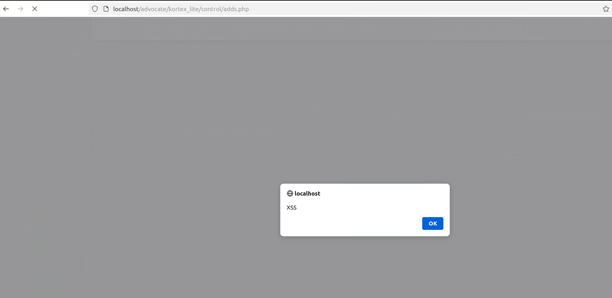
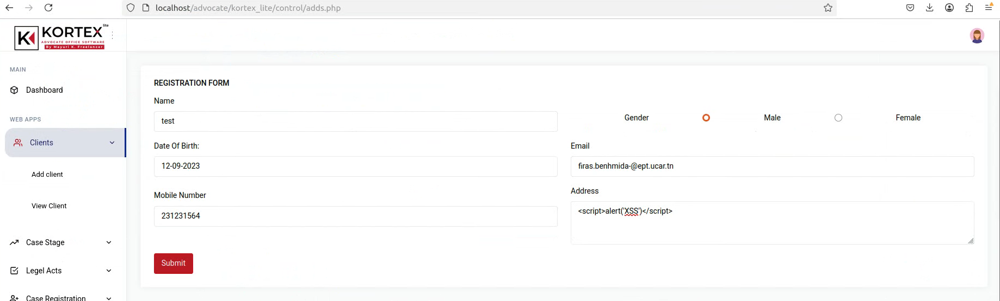

## Exploit Title: Advocate Kortex Lite – Reflected XSS in `adds.php` (`http://localhost/advocate/kortex_lite/control/adds.php`)

**Date:** 2025-08-24
**Exploit Author:** Anonymous
**Vendor Homepage:** N/A (local project)
**Software Link:** N/A (local project)
**Version:** N/A
**Tested on:** PHP 7.x on Ubuntu 20.04

---

## Summary

A **Reflected Cross-Site Scripting (XSS)** vulnerability exists in `adds.php`. The **`address`** field accepts unsanitized input that is immediately echoed back on the same page, enabling execution of arbitrary JavaScript in the victim’s browser.

**CWE:** CWE-79 (Improper Neutralization of Input During Web Page Generation)
**Severity:** High (placeholder — adjust once CVSS is computed)

## Affected Component & Parameter

* **URL:** `http://localhost/advocate/kortex_lite/control/adds.php`
* **Method:** POST (form submission)
* **Parameter:** `address`

## XSS Type & Example Payloads

```html
<script>alert(1)</script>
```

```
" autofocus onfocus=alert(1) x=
```

```html

```

## Rendered XSS Evidence




## Technical Description

The input `address` is inserted into the page without HTML encoding, causing immediate JavaScript execution.

## Impact

* Arbitrary JavaScript execution
* Session/token theft
* Privilege escalation if authenticated users trigger it

## Steps to Reproduce

1. Open the vulnerable page.
2. Submit payload in the `address` field.
3. Observe alert execution.

## Vulnerable Code (Screenshot)


