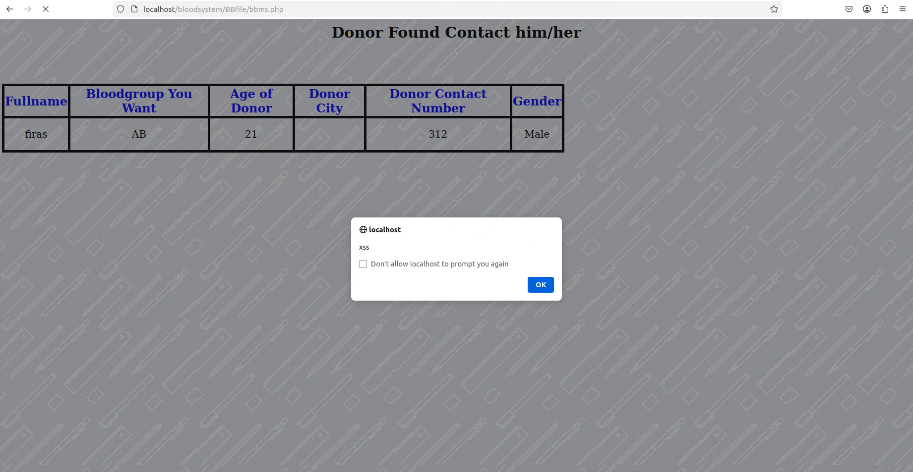
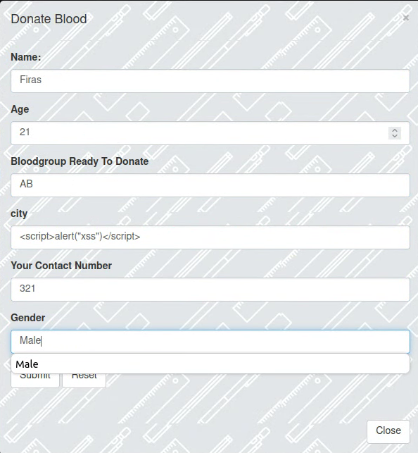
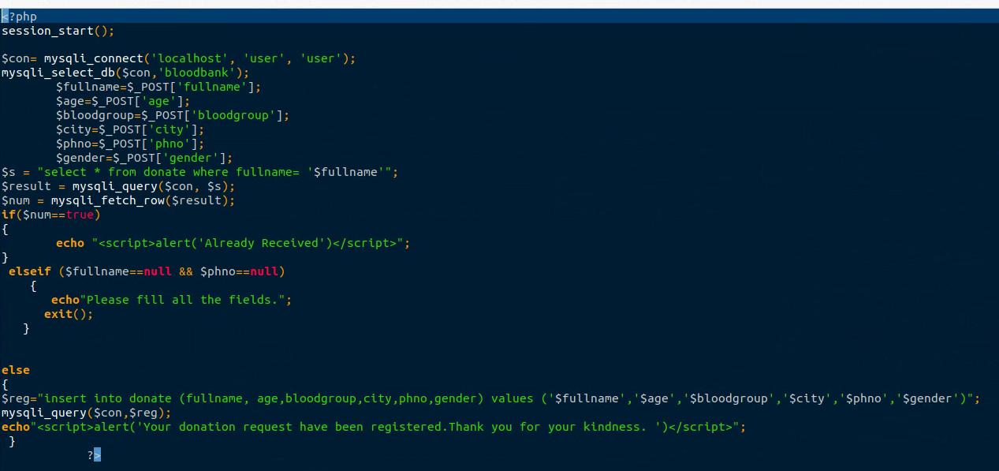

## Exploit Title: Blood System – Stored XSS via `don.php` (`http://localhost/bloodsystem/BBfile/don.php` → `profile.php`)

**Date:** 2025-08-11  
**Exploit Author:** Anonymous  
**Vendor Homepage:** https://code-projects.org/  
**Software Link:** https://code-projects.org/blood-bank-system-in-php-with-source-code/  
**Version:** 1.0  
**Tested on:** PHP 7.4 on Ubuntu 20.04  

---

## Summary

A **Stored Cross-Site Scripting (XSS)** vulnerability exists. The **`city`** field in `don.php` is stored and later rendered in `profile.php` without sanitization.

**CWE:** CWE-79 (Stored XSS)
**Severity:** High

## Affected Component & Parameter

* **Source:** `don.php` (POST param `city`)
* **Sink:** `bbms.php`

## XSS Type & Example Payloads

```html
<script>alert('xss-bloodsystem')</script>
```

```
" autofocus onfocus=alert('xss') x=
```

```html

```

## Rendered XSS Evidence





## Technical Description

The `city` parameter is persisted and rendered unescaped in `profile.php`, causing persistent XSS.

## Impact

* Script executes for all viewers
* Credential theft and privilege abuse possible

## Steps to Reproduce

1. Submit payload in `city` field at `don.php`.
2. View `bbms.php`.
3. Observe alert execution.

## Vulnerable Code (Screenshot)




