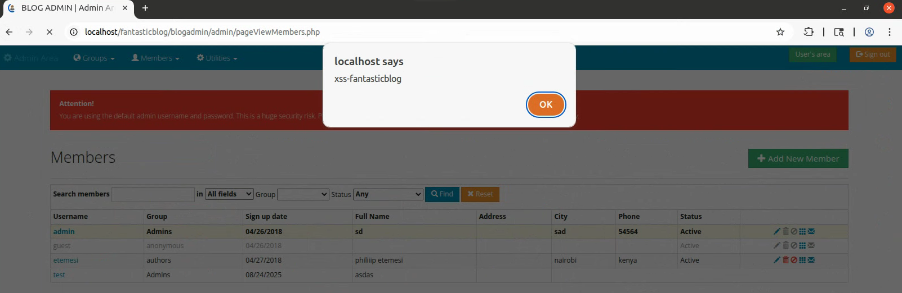

## Exploit Title: FantasticBlog – Stored XSS via `pageEditMember.php` (`http://localhost/fantasticblog/blogadmin/admin/pageEditMember.php` → `ViewpageMember.php`)

**Date:** 2025-08-24 \
**Exploit Author:** Anonymous \
**Vendor Homepage:** https://www.sourcecodester.com/php/12258/fantastic-blog-cms-php.html \
**Software Link:**  https://www.sourcecodester.com/download-code?nid=12258&title=Fantastic+Blog+%28CMS%29+in+PHP+with+Source+Code \
**Version:** 1.0 \
**Tested on:** PHP 7.x on Ubuntu 20.04 

---

## Summary

A **Stored Cross-Site Scripting (XSS)** vulnerability exists. The **`address`** field in `pageEditMember.php` accepts unsanitized input that is later rendered in `ViewpageMember.php`, leading to script execution.

**CWE:** CWE-79 (Stored XSS)
**Severity:** High

## Affected Component & Parameter

* **Source:** `pageEditMember.php` (POST param `address`)
* **Sink:** `ViewpageMember.php`

## XSS Type & Example Payloads

```html
<script>alert('xss-fantasticblog')</script>
```

```
" onmouseover=alert('xss') x=
```

```html

```

## Rendered XSS Evidence



## Technical Description

Input is stored unsanitized and rendered without escaping, causing persistent XSS.

## Impact

* Payload executes for all viewers
* Session theft and account compromise possible

## Steps to Reproduce

1. Edit member in `pageEditMember.php` with payload.
2. Open the same member in `ViewpageMember.php`.
3. Observe execution.

## Vulnerable Code (Screenshot)


